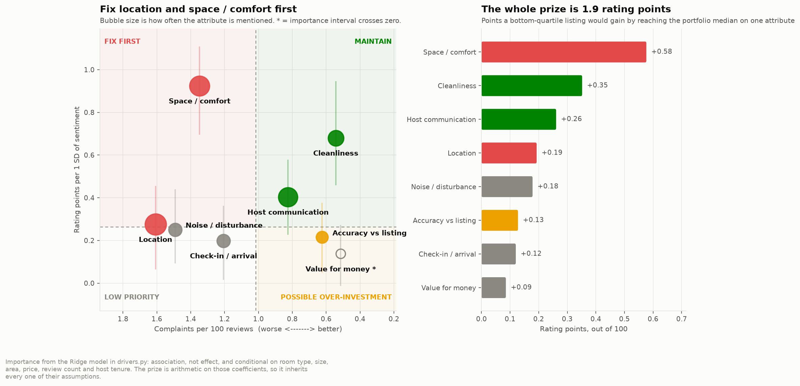
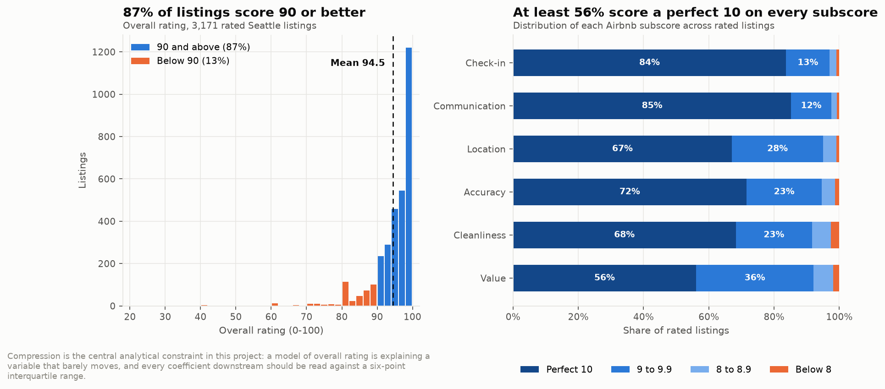
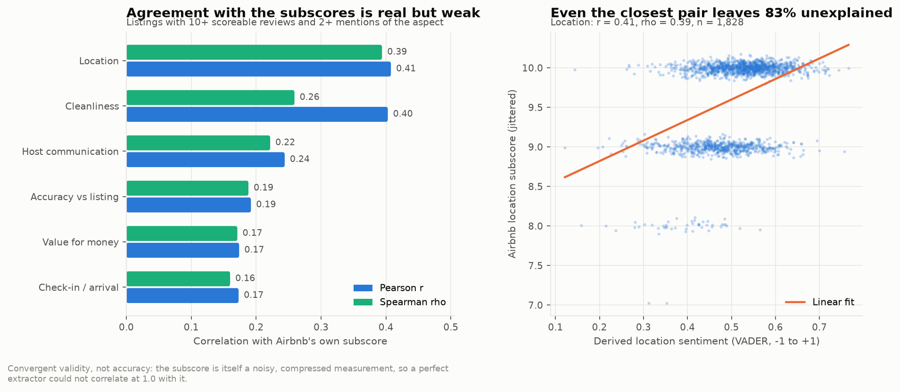
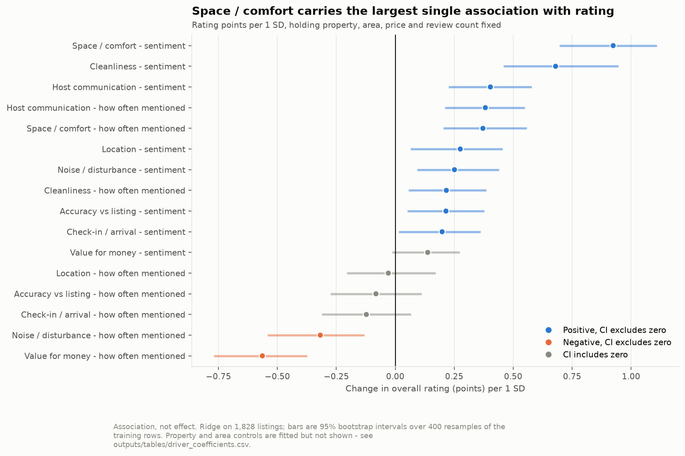
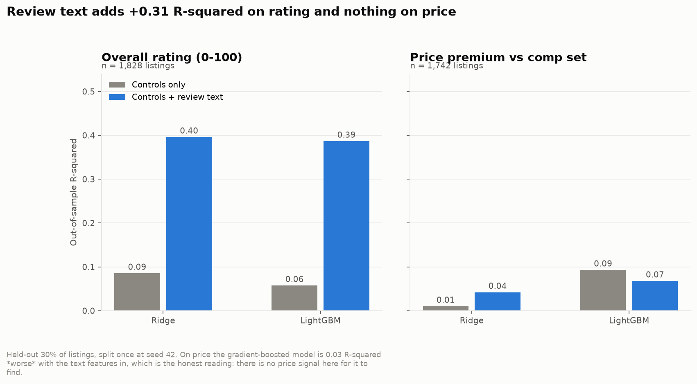
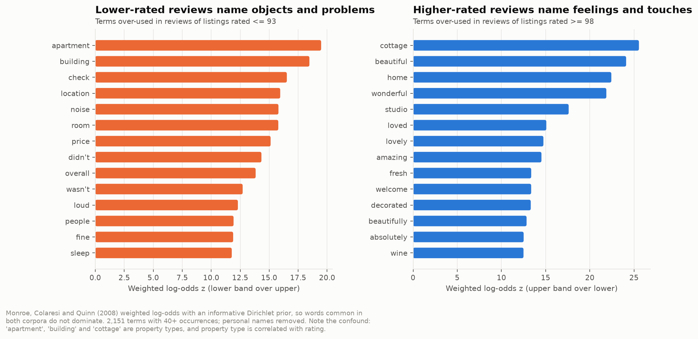
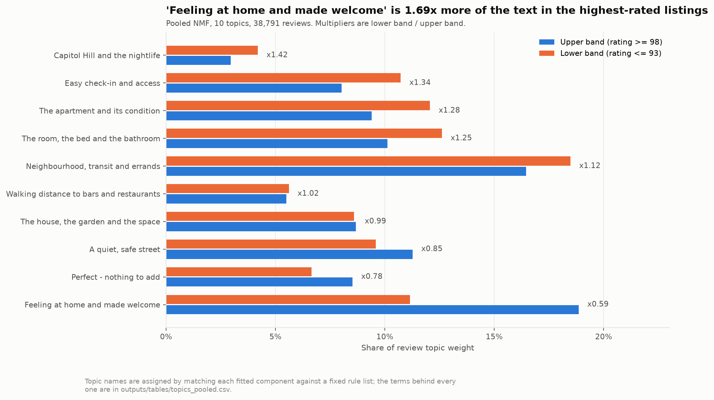
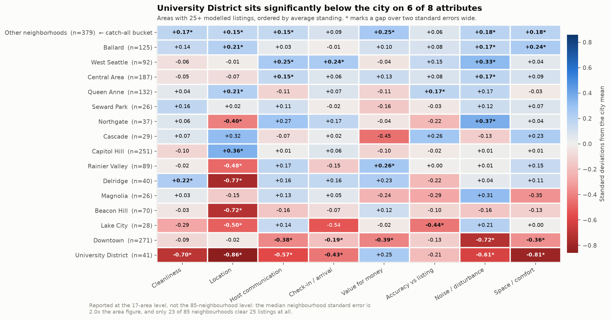

# What Guests Actually Care About

**Review mining and experience drivers for 3,818 Seattle Airbnb listings and 84,849 real guest reviews.**

> **The answer in one line.** Almost nothing goes wrong — the worst-performing
> attribute in the portfolio draws a complaint in **1.6 of every 100 reviews** —
> so ratings are not won by removing failures. They are won on **space and
> comfort**: beds, bathrooms, warmth and furnishing carry **+0.92 rating points
> per standard deviation** of guest sentiment, 1.4× cleanliness and 3.4×
> location. And almost none of it reaches price: review text explains **40% of
> the variation in rating and 4% of the price** a listing commands against its
> comparable set. Spend on the room. Expect the return in ranking and
> occupancy, not in rate.



---

## Contents

| | |
|---|---|
| **[Executive summary](docs/executive-summary.md)** | One page. Read this if you read nothing else. |
| **[Method notes](docs/method.md)** | How the eight aspects were defined, how the extraction was validated, and what the compressed rating distribution does to every claim here. |
| **[`src/`](src)** | The pipeline. Seven scripts, run in order by `make all` in about two minutes. |
| **[`outputs/`](outputs)** | Every figure and every number this write-up quotes, regenerated on each run. |
| **[Notebook](notebooks/walkthrough.ipynb)** | The narrative version, with the code and outputs visible. |
| **[`data/README.md`](data/README.md)** | Schema, provenance and the known quirks of the raw files. |

---

## The question

A property manager with a portfolio of listings has finite money to spend on
improvements. Guests leave 84,849 reviews and six numeric subscores.

**Which experience attributes actually move the rating and the price a listing
can command — and which are table stakes that no amount of extra investment
will improve?**

---

## What the data says

### 1 — The outcome barely moves, and that is the whole problem

The mean Seattle listing scores **94.5 out of 100**. **86.6%** score 90 or
better and **24.6%** score exactly 100. Every one of Airbnb's six subscores has
a median of 10 out of 10, and at least **46.5%** of listings score a perfect 10
on every single one of them.

This is the constraint the rest of the analysis works inside. A model of
"what drives ratings" is a model of a variable with an interquartile range of
**93 to 99** — six points on a hundred-point scale. Anything that claims a
large effect on it should be read with that in mind, and any recommendation
built on removing complaints is being built on a variable that is already near
its ceiling.



### 2 — The extraction works, and it works weakly

Eight aspects, 331 lexicon terms, **265,712 aspect mentions** pulled from
**283,221** of the corpus's 446,692 sentences. Only **2.3%** of scoreable
reviews mention no aspect at all.

Six of the eight aspects have an Airbnb subscore measuring the same thing,
collected separately from the text, so the extraction can be checked rather
than asserted. It correlates with those subscores at a mean Pearson **r =
0.27** — best on location (**0.41**), worst on check-in (**0.17**). The
strongest single validation signal is not sentiment at all: a listing's
**cleanliness complaint rate correlates −0.40** with its cleanliness subscore.

That is real agreement and it is weak agreement, and both halves matter. The
subscore is itself a compressed, heaped, noisy measurement — 57% of listings
score a perfect 10 on cleanliness — so a perfect extractor could not correlate
at 1.0 with it. But nobody should read the aspect scores below as
measurements of what guests felt. They are a noisy proxy that agrees with an
independent noisy proxy about as often as it disagrees.



### 3 — Space and comfort is the single largest driver, and price explains none of it

Holding room type, capacity, neighbourhood, nightly price, review count, host
tenure and amenity count fixed, a one-standard-deviation improvement in a
listing's **space and comfort** sentiment is associated with **+0.92 rating
points** (95% bootstrap interval **+0.70 to +1.11**). Cleanliness is worth
**+0.68**, host communication **+0.40**, location **+0.28**. Twelve of the
sixteen aspect features have intervals that exclude zero, and an unregularised
OLS refit with robust standard errors agrees with the Ridge ranking at a rank
correlation of **0.96**.

Two of the strongest effects are not sentiment but **salience**. The more often
guests mention **value for money** at all, the lower the rating (**−0.56** per
SD): price gets discussed when something has made it worth discussing.
Mentions of **noise** carry **−0.32**.



Now the second outcome. Against a comparable set — same neighbourhood group,
room type and capacity band, with the listing itself excluded from its own
benchmark — review text explains almost nothing about price. Ridge moves from
**0.010 to 0.042 R²** when the aspect block is added; gradient boosting gets
**worse**, from 0.093 to 0.068. The largest text association with price is
**5.7% per SD**, against a comp-set price spread of **37%**.



The gap between the two panels is the finding. Guest experience is strongly
associated with the rating and barely associated with the rate. A manager
improving the room is buying ranking and occupancy, not pricing power — at
least not within a single scrape of a single city.

### 4 — What separates a 98 from a 93 is hospitality, not the absence of problems

Fitting one topic model across reviews of the top and bottom rating quartiles
gives ten interpretable topics. The one that discriminates hardest is **"feeling
at home and made welcome"** — *home, wonderful, feel, welcome, beautiful,
lovely* — which takes up **1.69× more** of the text in top-quartile listings.

The term-level comparison says the same thing more bluntly. Weighted log-odds
with an informative Dirichlet prior puts *problem, issues, noisy, loud, sleep,
wasn't, didn't, price* on the lower-rated side, and *cottage, beautiful,
wonderful, loved, fresh, welcome, decorated, wine, coffee, fruit, snacks* on
the higher-rated side.

Bottom-quartile listings are described in **objects and faults**. Top-quartile
listings are described in **feelings and gestures**. One caveat sits right on
top of that: *apartment*, *building* and *cottage* are property types, and
property type is correlated with rating, so part of this contrast is a
property-mix effect rather than a hospitality effect.




### 5 — Two of Seattle's areas are structurally weaker, and it is not marginal

At the 17-area level — chosen because the median 87-way neighbourhood standard
error is **2.0×** the area figure and only **23 of 85** neighbourhoods clear 25
listings at all — the **University District** sits significantly below the city
on **6 of 8** attributes, including **−0.86 SD on location** and **−0.81 SD on
space and comfort**. **Downtown** is below on five. **Ballard** is the
strongest identifiable area.

Only **29% of the 128 area-by-attribute cells** differ from the city by more
than two standard errors. The map is mostly noise, and the marked cells are the
part worth acting on.



---

## The recommendation

**Fund the room. Stop funding the things that already work.**

| | |
|---|---|
| **Fix first** | **Space and comfort** and **location**. Both carry above-median importance *and* above-median complaint rates. Space and comfort is the largest prize in the portfolio at **+0.58 rating points** for a bottom-quartile listing reaching the median. |
| **Maintain** | **Cleanliness** and **host communication**. High importance, lowest complaint rates in the portfolio (0.5 and 0.8 per 100 reviews). These are working. Protect them with standards, do not fund them with capital. |
| **Low priority** | **Check-in** and **noise**. Complaints happen, but moving them moves the rating least. Fix them when they are cheap; do not build a programme around them. |
| **Possible over-investment** | **Accuracy vs listing** and **value for money**. Already excellent and low-importance. Value's importance interval crosses zero, so it is not evidence of over-investment so much as an absence of evidence either way. |
| **Size of the whole prize** | **1.89 rating points** if every attribute in a bottom-quartile listing were lifted to the portfolio median. On a base of 94.5 that is roughly a quarter of the distance to a perfect score — real, and smaller than most review-optimisation pitches imply. |
| **Where to buy** | Not the **University District**, which is below the city on six of eight attributes and cannot be fixed with furniture. **Ballard** and **West Seattle** carry the strongest experience profiles among identifiable areas. |

---

## What this analysis cannot tell you

Stating this is part of the deliverable, not a disclaimer bolted on.

- **Nothing here is causal.** Every coefficient is a conditional association.
  The confound I cannot rule out is the obvious one: a host who furnishes a
  flat well is also, on average, a host who writes an honest listing, replies
  within the hour and prices sensibly. "Space and comfort raises the rating"
  and "conscientious hosts do everything well, and furnishing is the part
  guests write down" fit these data identically. Separating them needs an
  intervention, not more features.
- **The outcome is compressed.** 86.6% of listings score 90+. The model
  explains 40% of the variance in a variable whose interquartile range is six
  points. A 0.92-point coefficient is large *relative to that spread* and small
  in absolute terms, and the write-up above should be read that way.
- **Reviewers are self-selected, twice over.** Guests who had a bad stay
  disproportionately do not review; guests who review at all knew the host's
  name and face. That is the most likely reason the complaint rates are so low,
  and it means "1.6 complaints per 100 reviews" is a floor, not an estimate.
- **English only.** 839 reviews (1.0%) were dropped as non-English. An audit of
  the survivors flags a further 51 (0.06%) as probable misses. Both the aspect
  lexicon and VADER are English-only; a Spanish complaint about a dirty bathroom
  is invisible to this pipeline.
- **The lexicon has finite recall.** It covers 53% of the non-generic noun
  heads that a spaCy pass mines from the corpus, and 74% weighted by frequency.
  The largest uncovered terms are *spot, coffee, car, plenty, store, building,
  problem, issue*. Some of those are genuine gaps.
- **VADER is blind to factual praise.** "Exactly as described, the photos were
  completely accurate" scores 0.0 — neither *described* nor *accurate* is in
  VADER's lexicon. The accuracy aspect is therefore systematically better at
  detecting complaints than compliments, which is the most likely reason its
  agreement with Airbnb's own accuracy subscore is among the weakest measured.
  There is a test that fails if this ever stops being true.
- **This is Seattle in January 2016.** One city, one platform, one scrape,
  pre-professionalisation and pre-pandemic. The method transfers. The
  coefficients do not.
- **Price is a cross-section, not an experiment.** The comp-set premium is
  what a host *asked* on the scrape date, not what they achieved. Occupancy,
  discounting and length-of-stay effects are all invisible here.

---

## About this repository

Developed locally over July and August 2026 as a personal learning project,
then reworked and published here in September 2026 to make it shareable. The
pipeline was re-run on publication, so every figure and number in this write-
up comes from the committed code rather than from the original working files.

A learning exercise and a portfolio piece, not a product. It is not built for
deployment, not maintained, and not intended for production use. The analysis
is fixed to the dataset vintage documented below, and the code is written to
be read and re-run rather than shipped.

## Reproducing it

```bash
git clone https://github.com/Paariineetaa/airbnb-guest-experience-nlp.git
cd airbnb-guest-experience-nlp
python -m venv .venv && source .venv/bin/activate
pip install -r requirements.txt
python -m spacy download en_core_web_sm   # optional, see below

make data        # checks for the raw CSVs and prints where to get them
make all         # ~2 minutes: rebuilds every figure and every metric
make test        # 44 checks: cleaning, extraction, comp sets, minimum-n guards
make lint        # ruff
```

`make all` regenerates everything in `outputs/`, including the seven JSON files
that every number in this README is read from. Nothing here is typed by hand.

**On spaCy.** `aspects.py` uses `en_core_web_sm` to re-mine the corpus
vocabulary and audit what the frozen aspect lexicon is missing — the numbers in
the recall bullet above come from that pass. It is the only place spaCy is
used, and the extraction itself runs on a compiled lexicon so the pipeline is
deterministic and fast. If spaCy or its model is unavailable the audit falls
back to a scikit-learn term-frequency pass and records which method it used in
`outputs/aspect_metrics.json`. CI runs without the model.

---

## Data

| Dataset | Rows | Source |
|---|---|---|
| Seattle listings | 3,818 listings × 92 columns; 3,171 with a rating | [Inside Airbnb](http://insideairbnb.com/get-the-data/), Seattle scrape of 4 January 2016 |
| Seattle reviews | 84,849 reviews, 74,436 reviewers, June 2009 – January 2016 | Same scrape |
| Mirror | Both files as published | [Kaggle: Seattle Airbnb Open Data](https://www.kaggle.com/datasets/airbnb/seattle) |

Inside Airbnb publishes under CC BY 4.0. The data is scraped from public
listing pages. Raw data is not committed — `data/raw/` is gitignored and
`make data` tells you where to get it. `data/sample/` holds a 220-listing
extract, deliberately including cancellation notices and non-English reviews,
so the tests run without a download. Reviewer and host first names are
stop-listed out of every model in this repo.

## Stack

`pandas` · `scikit-learn` · `LightGBM` · `statsmodels` · `vaderSentiment` ·
`spaCy` · `scipy` · `matplotlib`

Licensed MIT. Charts use a fixed, colour-vision-deficiency-safe palette defined
once in `src/viz.py`.
